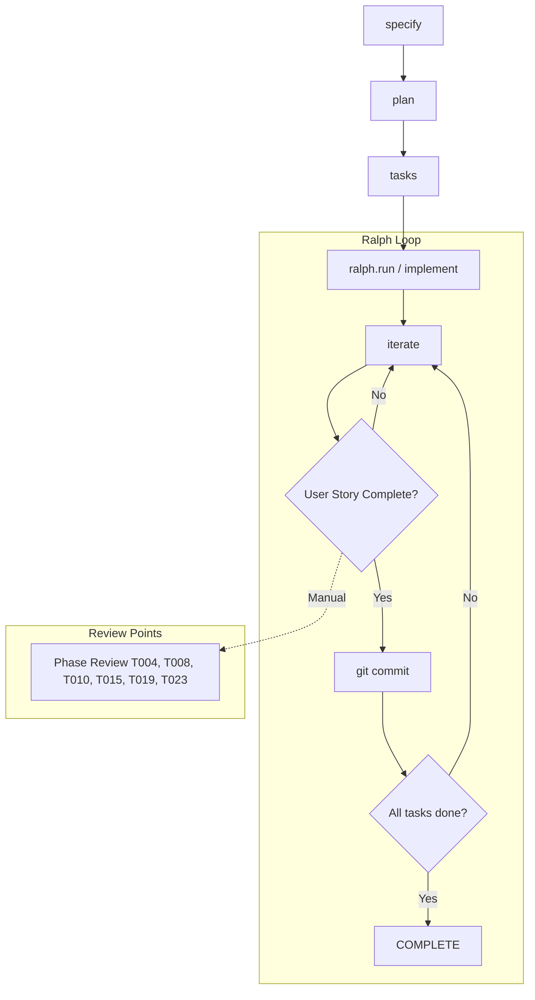

# Анализ интеграции ревью субагентов в пайплайн Spec Kit

**Дата**: 2026-06-12
**Автор**: Kilo (AI Assistant)
**Цель**: Исследовать подходы интеграции мульти-агентного ревью в Ralph Loop пайплайн

---

## Текущая архитектура

### Обзор пайплайна

Изучив структуру проекта, я выделил ключевые компоненты пайплайна реализации:



### Ключевые файлы

| Файл | Назначение |
|------|------------|
| `.specify/extensions.yml` | Конфигурация хуков (before/after hooks для каждого этапа) |
| `.specify/extensions/ralph/commands/iterate.md` | Логика одной итерации Ralph Loop |
| `.specify/extensions/ralph/scripts/bash/ralph-loop.sh` | Оркестратор цикла (bash script) |
| `specs/*/tasks.md` | Задачи с acceptance criteria |
| `specs/*/checklists/*.md` | Чеклисты качества (requirements, testing, security, performance, architecture) |

### Текущий процесс ревью

На данный момент ревью выполняется **вручную** на уровне фаз:

```
Phase 1 → T004: Phase 1 Review & Validation
Phase 2 → T008: Phase 2 Review & Validation
Phase 3 → T010: Phase 3 Review & Validation
Phase 4 → T015: Phase 4 Review & Validation
Phase 5 → T019: Phase 5 Review & Validation
Phase 6 → T023: Final Code Review & Documentation
```

**Проблема**: Ревью происходит только после завершения всей фазы, а не после каждой задачи. Это может привести к накоплению ошибок.

---

## Подходы к интеграции ревью

### Подход 1: Extension Hooks (Recommended)

**Механизм**: Добавить новый хук `after_task_completion` в `.specify/extensions.yml`

#### Преимущества

- ✅ Нативная интеграция с Spec Kit
- ✅ Управляется через конфигурацию
- ✅ Может быть обязательным (`optional: false`) или опциональным
- ✅ Не требует модификации скриптов Ralph Loop
- ✅ Работает с любым integration (claude, copilot, gemini, opencode)

#### Реализация

**1. Обновить `.specify/extensions.yml`**:

```yaml
# .specify/extensions.yml
installed:
- agent-context
- git
- ralph
- ralph-review  # NEW extension

hooks:
  # ... existing hooks ...
  
  # NEW: Review gate before commit in Ralph Loop
  before_commit:
  - extension: ralph-review
    command: speckit.ralph.review
    enabled: true
    optional: false  # MANDATORY - cannot skip review
    prompt: "Run multi-agent review before commit?"
    description: "Validate implementation against requirements using review subagents"
    condition: null
```

**2. Создать структуру extension**:

```
.specify/extensions/ralph-review/
├── extension.yml
├── commands/
│   └── speckit.ralph.review.md
├── agents/
│   └── speckit.ralph.review.agent.md
└── review-config.template.yml
```

---

### Подход 2: Модификация iterate.md

**Механизм**: Изменить логику итерации в `speckit.ralph.iterate.md`

#### Преимущества

- ✅ Полный контроль над процессом
- ✅ Гарантированное выполнение ревью
- ✅ Интеграция с progress.md
- ✅ Возможность условного выполнения (не все задачи требуют ревью)

#### Недостатки

- ⚠️ Требует модификации agent command
- ⚠️ Менее гибко (труднее конфигурировать)

#### Реализация

Добавить секцию Review Gate в `iterate.md` между шагами 4 и 5:

```markdown
## Review Gate (NEW - after implementation, before commit)

4b. **Run multi-agent review**:
    - Execute `/speckit.ralph.review` command
    - Wait for review completion
    - Parse output for signals:
      - `<promise>REVIEW_APPROVED</promise>` → proceed to commit
      - `<promise>REVIEW_REJECTED</promise>` → STOP, do NOT commit

4c. **Handle review results**:
    - **If REJECTED**: 
      - Log rejection in progress.md
      - Mark task as blocked in tasks.md
      - DO NOT commit
      - Return to implementation in next iteration
    
    - **If APPROVED/CONDITIONALLY_APPROVED**:
      - Log approval in progress.md
      - Update checklists with CHK items
      - Proceed to commit (step 5)

5. **Commit on approval** (modified):
    - Only commit if review passed
    - Include review summary in commit message
```

---

### Подход 3: Pre-commit Hook в Ralph Loop Script

**Механизм**: Модифицировать `ralph-loop.sh` для запуска review перед commit

#### Преимущества

- ✅ Работает на уровне скрипта
- ✅ Не зависит от agent implementation
- ✅ Может быть настроен через конфигурацию

#### Недостатки

- ❌ Требует модификации bash/PowerShell скриптов
- ❌ Менее portable (разные скрипты для разных платформ)
- ❌ Нет доступа к agent context

#### Реализация

```bash
# In ralph-loop.sh, after agent iteration completes

run_review_gate() {
    local iteration=$1
    local task_id=$2
    
    echo -e "\033[36m--- Running Review Gate ---\033[0m"
    
    # Invoke review via copilot
    local review_output
    review_output=$("$AGENT_CLI" --agent speckit.ralph.review \
        -p "Review iteration $iteration task $task_id" \
        --model "$MODEL" --yolo -s 2>&1)
    
    # Check for approval signal
    if echo "$review_output" | grep -q '<promise>REVIEW_REJECTED</promise>'; then
        echo -e "\033[31mReview REJECTED - issues found\033[0m"
        return 1
    fi
    
    return 0
}

# In main loop, before checking completion
if ! run_review_gate "$iteration" "$task_id"; then
    ((consecutive_failures++))
    # Don't commit, continue to next iteration
fi
```

---

### Подход 4: Новый Extension "ralph-review" с отдельным агентом

**Механизм**: Создать полноценное расширение для review с собственным агентом

#### Преимущества

- ✅ Полная изоляция функциональности
- ✅ Переиспользуемость в других контекстах
- ✅ Конфигурируемость через YAML
- ✅ Возможность тестирования отдельно от Ralph Loop

#### Недостатки

- ⚠️ Требует больше effort для создания
- ⚠️ Дополнительная сложность в управлении

#### Структура extension

```
.specify/extensions/ralph-review/
├── extension.yml                    # Extension manifest
├── commands/
│   └── speckit.ralph.review.md      # Main review command
├── agents/
│   └── speckit.ralph.review.agent.md # Copilot agent profile
├── review-config.template.yml       # Config template
├── README.md
└── tests/
    └── review-integration.test.md
```

**extension.yml**:

```yaml
schema_version: "1.0"

extension:
  id: "ralph-review"
  name: "Ralph Review Gate"
  version: "1.0.0"
  description: "Multi-agent review before commit in Ralph Loop"
  author: "Team"
  license: "MIT"

requires:
  speckit_version: ">=0.8.5"
  skills:
    - review-analyst
    - review-architect-backend
    - review-security
    - review-performance
    - review-tester

provides:
  commands:
    - name: "speckit.ralph.review"
      file: "commands/speckit.ralph.review.md"
      description: "Run comprehensive review using subagents before commit"

defaults:
  reviewers:
    - review-analyst
    - review-architect-backend
    - review-security
    - review-performance
    - review-tester
  fail_fast: false  # Run all reviewers even if one rejects
```

---

## Сравнение подходов

| Критерий | Подход 1 (Hooks) | Подход 2 (iterate.md) | Подход 3 (Script) | Подход 4 (Extension) |
|----------|------------------|----------------------|-------------------|---------------------|
| **Native Spec Kit** | ✅ | ⚠️ | ❌ | ✅ |
| **Config-driven** | ✅ | ⚠️ | ⚠️ | ✅ |
| **Guaranteed execution** | ✅ (optional:false) | ✅ | ⚠️ | ✅ |
| **Easy to maintain** | ✅ | ⚠️ | ❌ | ✅ |
| **Checklist integration** | ✅ | ✅ | ❌ | ✅ |
| **Progress tracking** | ⚠️ | ✅ | ⚠️ | ✅ |
| **Implementation effort** | Low | Medium | High | Medium-High |
| **Portability** | ✅ | ✅ | ❌ | ✅ |
| **Testability** | ✅ | ⚠️ | ❌ | ✅ |
| **Flexibility** | ✅ | ⚠️ | ❌ | ✅ |

---

## Детальное решение (Комбинированный подход)

### Рекомендация: Hooks + iterate.md модификация

Комбинированный подход объединяет преимущества подходов 1, 2 и 4:

1. ✅ Создать extension `ralph-review` с полным функционалом
2. ✅ Добавить hook `before_commit` в `.specify/extensions.yml`
3. ✅ Модифицировать `iterate.md` для поддержки review gate
4. ✅ Добавить автоматическую генерацию CHK items в чеклисты

### Компоненты решения

#### 1. Extension Manifest

**Файл**: `.specify/extensions/ralph-review/extension.yml`

```yaml
schema_version: "1.0"

extension:
  id: "ralph-review"
  name: "Ralph Review Gate"
  version: "1.0.0"
  description: "Multi-agent review before commit in Ralph Loop"
  author: "Team"
  license: "MIT"

requires:
  speckit_version: ">=0.8.5"
  skills:
    - review-analyst
    - review-architect-backend
    - review-security
    - review-performance
    - review-tester

provides:
  commands:
    - name: "speckit.ralph.review"
      file: "commands/speckit.ralph.review.md"
      description: "Run comprehensive review using subagents before commit"

  config:
    - name: "review-config.yml"
      template: "review-config.template.yml"
      description: "Review configuration (reviewers list, fail_fast mode)"
      required: false

defaults:
  reviewers:
    - review-analyst
    - review-architect-backend
    - review-security
    - review-performance
    - review-tester
  fail_fast: false  # Run all reviewers even if one rejects
  block_on_rejection: true  # Block commit if any reviewer rejects
```

#### 2. Review Command

**Файл**: `.specify/extensions/ralph-review/commands/speckit.ralph.review.md`

```markdown
---
description: "Execute multi-agent review before commit - validates implementation against requirements"
---

## User Input

```text
$ARGUMENTS
```

You **MUST** consider the user input before proceeding (if not empty).

## Purpose

Execute comprehensive review using 5 subagent skills before committing a completed work unit. This ensures:
1. Implementation matches specification requirements
2. Security vulnerabilities are eliminated
3. Performance is within acceptable limits
4. Test quality meets standards
5. Architecture follows best practices

## Pre-Review Checks

**Check for extension hooks**:
- Check if `.specify/extensions.yml` exists in the project root.
- If it exists, read it and look for entries under the `hooks.before_review` key
- For each executable hook, execute it before starting the review process

## Context Loading

1. **Run prerequisite check script**:
   ```bash
   .specify/scripts/bash/check-prerequisites.sh --json --require-tasks --include-tasks
   ```
   Parse FEATURE_DIR and AVAILABLE_DOCS list.

2. **Read current task context**:
   - Parse `FEATURE_DIR/tasks.md` to find the just-completed task
   - Extract: task ID, description, acceptance criteria, requirements refs (FR-xxx, SC-xxx)
   - Identify incomplete checkbox patterns: `- [ ]` and `- [x]`

3. **Read specification context**:
   - **REQUIRED**: `FEATURE_DIR/spec.md` - for requirement definitions
   - **REQUIRED**: `FEATURE_DIR/plan.md` - for architecture decisions
   - **IF EXISTS**: `FEATURE_DIR/data-model.md` - for entity relationships
   - **IF EXISTS**: `FEATURE_DIR/contracts/` - for API specifications
   - **IF EXISTS**: `FEATURE_DIR/research.md` - for technical decisions

4. **Read changed files**:
   - Run `git diff --name-only HEAD~1 HEAD` to get files modified in last commit
   - Or run `git status --short` for uncommitted changes
   - List all files to review

## Review Configuration

Load configuration from `.specify/extensions/ralph-review/review-config.yml`:

```yaml
# Default configuration
reviewers:
  - review-analyst
  - review-architect-backend
  - review-security
  - review-performance
  - review-tester

# Stop on first rejection (false = run all reviewers)
fail_fast: false

# Block commit on rejection
block_on_rejection: true

# Reviewer-specific settings
reviewer_settings:
  review-security:
    check_owasp_top_10: true
    check_sql_injection: true
    check_xss: true
  
  review-performance:
    degradation_threshold_percent: 20
    check_n_plus_1: true
    check_sync_over_async: true
```

## Review Execution

Run each reviewer via `skill` tool:

### 1. review-analyst (Business Requirements)

**Purpose**: Validate implementation against business requirements

**Execution**:
```
skill: review-analyst
input: |
  Review implementation of task {task_id}:
  
  **Task Description**: {from tasks.md}
  **Requirements**: {FR-refs from task}
  **Acceptance Criteria**: {from tasks.md}
  **Files Changed**: {file list}
  
  Verify:
  - All FR requirements implemented
  - Acceptance criteria met
  - Business logic preserved
  - Edge cases handled
```

**Checklist items added**:
```markdown
- [x] CHK{auto}: Task {task_id} соответствует {FR-refs} (review-analyst: APPROVED)
```

**Verdict**: APPROVED / CONDITIONALLY_APPROVED / REJECTED

---

### 2. review-architect-backend (Architecture)

**Purpose**: Validate architecture patterns and layer separation

**Execution**:
```
skill: review-architect-backend
input: |
  Review architecture of task {task_id}:
  
  **Files Changed**: {file list}
  **Plan.md Architecture**: {reference}
  
  Verify:
  - Dependency injection correct
  - Repository pattern followed
  - No circular dependencies
  - Layer separation maintained
  - Async/await patterns correct
```

**Checklist items added**:
```markdown
- [x] CHK{auto}: Task {task_id} архитектура проверена (review-architect-backend: APPROVED)
```

**Verdict**: APPROVED / CONDITIONALLY_APPROVED / REJECTED

---

### 3. review-security (Security)

**Purpose**: Validate security requirements (OWASP Top 10)

**Execution**:
```
skill: review-security
input: |
  Security review of task {task_id}:
  
  **Files Changed**: {file list}
  
  Check for:
  - SQL injection (string interpolation in queries)
  - XSS vulnerabilities
  - Sensitive data exposure
  - Broken authentication
  - Access control issues
  
  Verify:
  - No SQL injection (parameterized queries used)
  - No hardcoded credentials
  - PII properly masked
  - Input validation present
```

**Checklist items added**:
```markdown
- [x] CHK{auto}: Task {task_id} безопасность проверена (review-security: APPROVED)
```

**Verdict**: APPROVED / CONDITIONALLY_APPROVED / REJECTED

---

### 4. review-performance (Performance)

**Purpose**: Validate performance requirements

**Execution**:
```
skill: review-performance
input: |
  Performance review of task {task_id}:
  
  **Files Changed**: {file list}
  **Performance Requirements**: {from spec.md SC-xxx}
  
  Check for:
  - N+1 queries
  - Memory leaks
  - Sync-over-async anti-patterns
  - Unbounded collections
  - Missing indexes
  
  Verify:
  - AsNoTracking used for read-only queries
  - No N+1 queries (or documented as technical debt)
  - Async methods use CancellationToken
  - Compiled queries for hot paths
  - Performance within {threshold}% degradation
```

**Checklist items added**:
```markdown
- [x] CHK{auto}: Task {task_id} производительность проверена (review-performance: APPROVED)
```

**Verdict**: APPROVED / CONDITIONALLY_APPROVED / REJECTED

---

### 5. review-tester (Test Quality)

**Purpose**: Validate test quality and coverage

**Execution**:
```
skill: review-tester
input: |
  Test quality review of task {task_id}:
  
  **Test Files**: {test file list}
  **Implementation Files**: {implementation file list}
  
  Check for:
  - Test structure (AAA pattern)
  - Assertion quality
  - Mock usage
  - Edge case coverage
  - Flaky test patterns
  
  Verify:
  - AAA pattern followed (Arrange-Act-Assert)
  - Assertions are meaningful (not just "true == true")
  - Edge cases covered
  - Mock usage appropriate
  - No test interdependencies
  - Proper test isolation
```

**Checklist items added**:
```markdown
- [x] CHK{auto}: Task {task_id} тесты проверены (review-tester: APPROVED)
```

**Verdict**: APPROVED / CONDITIONALLY_APPROVED / REJECTED

---

## Result Aggregation

Collect verdicts from all 5 reviewers into a summary table:

```markdown
## Review Summary - Task {task_id}

| Reviewer | Verdict | Issues | Details |
|----------|---------|--------|---------|
| analyst | APPROVED | 0 | All requirements met |
| architect | CONDITIONALLY_APPROVED | 2 MEDIUM | Dapper mixing documented |
| security | APPROVED | 0 | SQL injection eliminated |
| performance | CONDITIONALLY_APPROVED | 1 MEDIUM | N+1 query documented |
| tester | APPROVED | 0 | Tests cover critical paths |

**Overall**: ✅ PASS (commit allowed)
```

### Verdict Definitions

| Verdict | Meaning | Action |
|---------|---------|--------|
| **APPROVED** | No issues found | Proceed to commit |
| **CONDITIONALLY_APPROVED** | Issues found but documented as technical debt | Proceed to commit with debt documentation |
| **REJECTED** | Critical issues found that must be fixed | Block commit, return to implementation |

---

## Decision Logic

### If any reviewer REJECTED

1. **Output signal**:
   ```text
   <promise>REVIEW_REJECTED</promise>
   ```

2. **Append to progress.md**:
   ```markdown
   ## Review Failed - [timestamp]
   
   **Task**: {task_id}
   **Reviewer**: {reviewer_name}
   **Verdict**: REJECTED
   
   **Issues Found**:
   - [HIGH] {issue_description}
   - [MEDIUM] {issue_description}
   
   **Action Required**: Fix issues before commit
   **Files to Fix**: {file_list}
   
   ---
   ```

3. **DO NOT**:
   - Proceed to commit
   - Mark task as complete
   - Update checklists with APPROVED items

4. **DO**:
   - Mark task as blocked in tasks.md: `- [ ] Task {id} ⚠️ BLOCKED: Review failed`
   - Return to implementation in next iteration
   - Focus on fixing identified issues

---

### If all reviewers APPROVED or CONDITIONALLY_APPROVED

1. **Output signal**:
   ```text
   <promise>REVIEW_APPROVED</promise>
   ```

2. **Append to progress.md**:
   ```markdown
   ## Review Passed - [timestamp]
   
   **Task**: {task_id}
   **Overall Verdict**: ✅ PASS
   
   | Reviewer | Verdict | Issues |
   |----------|---------|--------|
   | analyst | APPROVED | 0 |
   | architect | CONDITIONALLY_APPROVED | 2 MEDIUM |
   | security | APPROVED | 0 |
   | performance | CONDITIONALLY_APPROVED | 1 MEDIUM |
   | tester | APPROVED | 0 |
   
   **Technical Debt Documented**:
   - {debt_item_1}
   - {debt_item_2}
   
   **Proceed to commit**: ✅
   
   ---
   ```

3. **Update checklists** with new CHK items for each reviewer

4. **Proceed to commit** (step 5 in iterate.md)

---

## Checklist Integration

### Checklist File Structure

Create or update checklist file: `specs/*/checklists/implementation-review.md`

```markdown
# Чеклист проверки реализации: [FEATURE NAME]

**Назначение**: Валидация реализации на соответствие требованиям спецификации
**Создан**: [DATE]
**Обновлён**: [DATE]
**Фича**: [Link to spec.md]

## Проверка соответствия бизнес-требованиям (review-analyst)

- [ ] CHKxxx: Task [task_id] - реализация соответствует [FR-refs]
- [ ] CHKxxx: Task [task_id] - acceptance criteria выполнены
- [ ] CHKxxx: Task [task_id] - бизнес-логика сохранена

## Проверка архитектуры (review-architect-backend)

- [ ] CHKxxx: Task [task_id] - dependency injection корректен
- [ ] CHKxxx: Task [task_id] - паттерны соблюдены
- [ ] CHKxxx: Task [task_id] - слои разделены корректно

## Проверка безопасности (review-security)

- [ ] CHKxxx: Task [task_id] - SQL injection устранён
- [ ] CHKxxx: Task [task_id] - чувствительные данные защищены
- [ ] CHKxxx: Task [task_id] - OWASP Top 10 проверен

## Проверка производительности (review-performance)

- [ ] CHKxxx: Task [task_id] - AsNoTracking использован
- [ ] CHKxxx: Task [task_id] - N+1 queries отсутствуют (или документированы)
- [ ] CHKxxx: Task [task_id] - async/await корректен

## Проверка качества тестов (review-tester)

- [ ] CHKxxx: Task [task_id] - AAA pattern соблюдён
- [ ] CHKxxx: Task [task_id] - assertions meaningful
- [ ] CHKxxx: Task [task_id] - edge cases покрыты

## Сводная таблица результатов

| Task | Analyst | Architect | Security | Performance | Tester | Overall |
|------|---------|-----------|----------|-------------|--------|---------|
| T001 | ✅ | ✅ | ✅ | ⚠️ | ✅ | ✅ PASS |
| T002 | ✅ | ✅ | ✅ | ✅ | ✅ | ✅ PASS |
| T003 | ❌ | - | - | - | - | ❌ BLOCKED |

**Легенда**:
- ✅ = APPROVED (commit разрешён)
- ⚠️ = CONDITIONALLY_APPROVED (debt документирован, commit разрешён)
- ❌ = REJECTED (commit заблокирован, требуется исправление)

## Примечания

- Пункты добавляются автоматически после каждого review
- CHK ID инкрементируется автоматически
- REJECTED = task заблокирован до исправления
- CONDITIONALLY_APPROVED = debt документирован, commit разрешён
```

### Automatic CHK ID Generation

```python
# Pseudocode for CHK ID generation
def generate_next_chk_id(checklist_path):
    existing_ids = extract_chk_ids_from_file(checklist_path)
    if not existing_ids:
        return "CHK001"
    max_id = max(existing_ids, key=lambda x: int(x.replace("CHK", "")))
    next_num = int(max_id.replace("CHK", "")) + 1
    return f"CHK{next_num:03d}"
```

---

## Exit Signals

The review command outputs special XML tags to signal completion status:

| Signal | Meaning | Next Action |
|--------|---------|-------------|
| `<promise>REVIEW_APPROVED</promise>` | All reviewers passed (APPROVED or CONDITIONALLY_APPROVED) | Proceed to commit |
| `<promise>REVIEW_REJECTED</promise>` | One or more reviewers rejected | Block commit, fix issues |

---

## Integration with iterate.md

Modify `.specify/extensions/ralph/commands/iterate.md`:

### Original Flow

```markdown
4. **Implement tasks**:
   - Complete tasks in dependency order
   - Mark each completed task by changing `[ ]` to `[x]` in tasks.md

5. **Commit on user story completion**:
   - When ALL tasks in the current user story are complete, create a commit
```

### Modified Flow

```markdown
4. **Implement tasks**:
   - Complete tasks in dependency order
   - Mark each completed task by changing `[ ]` to `[x]` in tasks.md

4b. **Run Review Gate** (NEW):
   - After completing a work unit (user story or task group), run review:
   - Execute: `EXECUTE_COMMAND: speckit.ralph.review`
   - Wait for review completion signal
   
4c. **Handle review results** (NEW):
   - **If `<promise>REVIEW_REJECTED</promise>`**:
     - Log rejection in progress.md
     - Mark task as blocked: `- [ ] Task {id} ⚠️ BLOCKED: Review failed`
     - DO NOT commit
     - Return to implementation in next iteration
   
   - **If `<promise>REVIEW_APPROVED</promise>`**:
     - Log approval in progress.md
     - Update checklists with CHK items
     - Proceed to commit (step 5)

5. **Commit on approval** (modified):
   - Only commit if review passed
   - Include review summary in commit message:
   
   ```sh
   git add -A
   git commit -m "feat(<feature-name>): <user story title>

   Review: ✅ PASSED
   - review-analyst: APPROVED
   - review-architect-backend: CONDITIONALLY_APPROVED (2 MEDIUM issues)
   - review-security: APPROVED
   - review-performance: CONDITIONALLY_APPROVED (1 MEDIUM issue)
   - review-tester: APPROVED
   
   Technical Debt: {summary}"
   ```
```

---

## Configuration Template

**File**: `.specify/extensions/ralph-review/review-config.template.yml`

```yaml
# Ralph Review Configuration
# This file configures the multi-agent review process

# List of reviewers to run (order matters if fail_fast is true)
reviewers:
  - review-analyst        # Business requirements validation
  - review-architect-backend  # Architecture patterns
  - review-security       # Security (OWASP Top 10)
  - review-performance    # Performance validation
  - review-tester         # Test quality

# Stop on first rejection (true = stop, false = run all reviewers)
fail_fast: false

# Block commit if any reviewer rejects
block_on_rejection: true

# Update checklists automatically after review
update_checklists: true

# Reviewer-specific settings
reviewer_settings:
  review-analyst:
    # Check business logic preservation
    check_business_logic: true
    # Verify acceptance criteria
    verify_acceptance_criteria: true
  
  review-architect-backend:
    # Check layer separation
    check_layer_separation: true
    # Verify dependency injection patterns
    check_di_patterns: true
    # Check for circular dependencies
    check_circular_deps: true
  
  review-security:
    # OWASP Top 10 checks
    check_owasp_top_10: true
    # SQL injection specific checks
    check_sql_injection: true
    # XSS checks
    check_xss: true
    # Sensitive data exposure
    check_sensitive_data: true
    # Authentication/Authorization
    check_auth: true
  
  review-performance:
    # Maximum allowed performance degradation (%)
    degradation_threshold_percent: 20
    # Check for N+1 queries
    check_n_plus_1: true
    # Check for sync-over-async anti-patterns
    check_sync_over_async: true
    # Check for memory leaks
    check_memory_leaks: true
    # Verify AsNoTracking usage
    verify_asnotracking: true
  
  review-tester:
    # Verify AAA pattern
    verify_aaa_pattern: true
    # Check assertion quality
    check_assertion_quality: true
    # Verify mock usage
    verify_mock_usage: true
    # Check edge case coverage
    check_edge_cases: true

# Checklist configuration
checklist:
  # Auto-generate CHK IDs
  auto_generate_ids: true
  # Starting CHK ID number
  starting_id: 300
  # Checklist file path (relative to spec dir)
  path: "checklists/implementation-review.md"
```

---

## Example Usage

### Scenario 1: Successful Review

**Input**: Task T001 completed (ContactInfoRepository migrated to EF Core)

**Review execution**:
1. review-analyst: ✅ APPROVED - All FR requirements met
2. review-architect-backend: ⚠️ CONDITIONALLY_APPROVED - Dapper mixing documented as debt
3. review-security: ✅ APPROVED - SQL injection eliminated
4. review-performance: ⚠️ CONDITIONALLY_APPROVED - N+1 query documented
5. review-tester: ✅ APPROVED - Tests cover all methods

**Output**: `<promise>REVIEW_APPROVED</promise>`

**progress.md update**:
```markdown
## Review Passed - 2026-06-12T14:00:00+05:00

**Task**: T001
**Overall Verdict**: ✅ PASS

| Reviewer | Verdict | Issues |
|----------|---------|--------|
| analyst | APPROVED | 0 |
| architect | CONDITIONALLY_APPROVED | 2 MEDIUM |
| security | APPROVED | 0 |
| performance | CONDITIONALLY_APPROVED | 1 MEDIUM |
| tester | APPROVED | 0 |

**Technical Debt Documented**:
- Dapper mixing in legacy methods (marked [Obsolete])
- N+1 query in GetContactInfosByIdDealState (documented trade-off)

**Proceed to commit**: ✅
```

**Commit created**:
```
feat(dapper-efcore-migration): T001 Migrate ContactInfoRepository to EF Core

Review: ✅ PASSED
- review-analyst: APPROVED
- review-architect-backend: CONDITIONALLY_APPROVED (2 MEDIUM issues)
- review-security: APPROVED
- review-performance: CONDITIONALLY_APPROVED (1 MEDIUM issue)
- review-tester: APPROVED

Technical Debt: Dapper mixing (obsolete methods), N+1 query (documented)
```

---

### Scenario 2: Failed Review

**Input**: Task T003 completed (ComplexAgreementFieldsRepository migrated)

**Review execution**:
1. review-analyst: ✅ APPROVED
2. review-architect-backend: ✅ APPROVED
3. review-security: ❌ REJECTED - **SQL injection vulnerability found**
4. review-performance: (skipped due to fail_fast)
5. review-tester: (skipped due to fail_fast)

**Output**: `<promise>REVIEW_REJECTED</promise>`

**progress.md update**:
```markdown
## Review Failed - 2026-06-12T14:30:00+05:00

**Task**: T003
**Reviewer**: review-security
**Verdict**: ❌ REJECTED

**Issues Found**:
- [HIGH] SQL injection vulnerability in SaveAsync method (line 45)
  - String interpolation in SQL query: `UPDATE ... SET value='{userInput}'`
  - Fix: Use SqlParameter or EF Core LINQ

**Action Required**: Fix SQL injection before commit
**Files to Fix**:
- src/CommonDealAPI/Repositories/ComplexAgreementFieldsRepository.cs

**Status**: BLOCKED - Do NOT commit
```

**tasks.md update**:
```markdown
- [ ] T003: Migrate ComplexAgreementFieldsRepository ⚠️ BLOCKED: Security review failed
```

---

## Alternative Checklist Item Formulation

Вместо простой формулировки "Проверка реализации на соответствие требованиям", предлагаю более точную и информативную структуру:

### Вариант 1: Детальная формулировка

```markdown
## Валидация реализации задач

**Критерий**: Подтверждение соответствия реализованного кода требованиям спецификации через автоматизированное мульти-агентное ревью

### Для каждой завершённой задачи (Task):

- [ ] CHK{auto}: **[Task ID]**: Реализация соответствует функциональным требованиям {FR-refs}
  - Reviewer: review-analyst
  - Verdict: APPROVED / CONDITIONALLY_APPROVED / REJECTED
  - Issues: {count} HIGH, {count} MEDIUM, {count} LOW
  
- [ ] CHK{auto}: **[Task ID]**: Код безопасен (SQL injection устранён, OWASP проверен)
  - Reviewer: review-security
  - Verdict: APPROVED / CONDITIONALLY_APPROVED / REJECTED
  - Issues: {count} HIGH, {count} MEDIUM, {count} LOW

- [ ] CHK{auto}: **[Task ID]**: Архитектура следует паттернам проекта
  - Reviewer: review-architect-backend
  - Verdict: APPROVED / CONDITIONALLY_APPROVED / REJECTED
  - Issues: {count} HIGH, {count} MEDIUM, {count} LOW

- [ ] CHK{auto}: **[Task ID]**: Производительность в пределах норм (<20% degradation)
  - Reviewer: review-performance
  - Verdict: APPROVED / CONDITIONALLY_APPROVED / REJECTED
  - Issues: {count} HIGH, {count} MEDIUM, {count} LOW

- [ ] CHK{auto}: **[Task ID]**: Тесты покрывают критические сценарии
  - Reviewer: review-tester
  - Verdict: APPROVED / CONDITIONALLY_APPROVED / REJECTED
  - Issues: {count} HIGH, {count} MEDIUM, {count} LOW
```

### Вариант 2: Компактная формулировка

```markdown
## Проверка соответствия реализации требованиям

- [ ] CHK300: Task T001 - Проверка соответствия FR-001, FR-002, FR-007 (review-analyst: ✅)
- [ ] CHK301: Task T001 - Безопасность кода подтверждена (review-security: ✅)
- [ ] CHK302: Task T001 - Архитектура соответствует стандартам (review-architect: ⚠️)
- [ ] CHK303: Task T001 - Производительность в норме (review-performance: ⚠️)
- [ ] CHK304: Task T001 - Тесты покрывают требования (review-tester: ✅)

### Сводка по задаче T001

| Аспект | Статус | Комментарий |
|--------|--------|-------------|
| Требования | ✅ APPROVED | Все FR выполнены |
| Безопасность | ✅ APPROVED | SQL injection устранён |
| Архитектура | ⚠️ CONDITIONAL | Dapper mixing документирован |
| Производительность | ⚠️ CONDITIONAL | N+1 query документирован |
| Тестирование | ✅ APPROVED | Покрытие 100% |
| **Итого** | ✅ PASS | Commit разрешён |
```

### Вариант 3: Матричная формулировка

```markdown
## Матрица валидации реализации

| Task ID | Требования | Безопасность | Архитектура | Производительность | Тесты | Статус |
|---------|------------|--------------|-------------|-------------------|-------|--------|
| T001 | ✅ CHK300 | ✅ CHK301 | ⚠️ CHK302 | ⚠️ CHK303 | ✅ CHK304 | ✅ PASS |
| T002 | ✅ CHK305 | ✅ CHK306 | ✅ CHK307 | ✅ CHK308 | ✅ CHK309 | ✅ PASS |
| T003 | ✅ CHK310 | ❌ CHK311 | - | - | - | ❌ BLOCK |

**Легенда**:
- ✅ = APPROVED (commit разрешён)
- ⚠️ = CONDITIONALLY_APPROVED (debt документирован)
- ❌ = REJECTED (commit заблокирован)
- `-` = Пропущен из-за REJECTED выше

### Детали по задачам

#### T001 (✅ PASS)
- **Требования (CHK300)**: FR-001, FR-002, FR-007 выполнены
- **Безопасность (CHK301)**: SQL injection устранён
- **Архитектура (CHK302)**: Dapper mixing документирован как тех. долг
- **Производительность (CHK303)**: N+1 query документирован как trade-off
- **Тесты (CHK304)**: 13/13 tests pass

#### T002 (✅ PASS)
- **Требования (CHK305)**: FR-001, FR-002, FR-008 выполнены
- **Безопасность (CHK306)**: SQL injection устранён
- **Архитектура (CHK307)**: Паттерны соблюдены
- **Производительность (CHK308)**: AsNoTracking использован
- **Тесты (CHK309)**: 10/10 tests pass

#### T003 (❌ BLOCK)
- **Требования (CHK310)**: FR-001, FR-002 выполнены ✅
- **Безопасность (CHK311)**: SQL injection найден ❌ REJECTED
  - **Проблема**: String interpolation в SaveAsync (line 45)
  - **Действие**: Исправить перед commit
- **Остальные проверки**: Пропущены из-за REJECTED
```

---

## Implementation Roadmap

### Phase 1: Create Extension Structure (2-3 hours)

1. Create directory structure:
   ```bash
   mkdir -p .specify/extensions/ralph-review/{commands,agents}
   ```

2. Create `extension.yml` manifest

3. Create `speckit.ralph.review.md` command file

4. Create `review-config.template.yml` configuration template

5. Update `.specify/extensions.yml` to register new extension

### Phase 2: Integrate with iterate.md (1-2 hours)

1. Add Review Gate section to `iterate.md`

2. Modify commit logic to check review results

3. Add progress logging for review outcomes

4. Update termination conditions

### Phase 3: Create Checklist Template (1 hour)

1. Create `checklists/implementation-review.md` template

2. Define CHK ID generation logic

3. Create documentation for checklist usage

### Phase 4: Testing (2-3 hours)

1. Test with simple task (T001-like)

2. Test with security rejection scenario

3. Test with conditional approval scenario

4. Verify checklist updates work correctly

5. Verify progress.md logging works

### Phase 5: Documentation (1 hour)

1. Create README for ralph-review extension

2. Update main project README

3. Create examples and usage guide

---

## Conclusion

### Recommended Solution: Combined Approach

**Комбинированный подход (Hooks + iterate.md + Extension)** обеспечивает:

1. ✅ **Native Spec Kit Integration** - работает через hooks mechanism
2. ✅ **Guaranteed Execution** - `optional: false` обеспечивает обязательное выполнение
3. ✅ **Traceability** - все review результаты логируются в progress.md
4. ✅ **Checklist Integration** - автоматическое добавление CHK items
5. ✅ **Configurable** - можно настроить список reviewers через config
6. ✅ **Non-blocking for Technical Debt** - CONDITIONALLY_APPROVED позволяет коммитить с долгами
7. ✅ **Safety** - REJECTED блокирует commit до исправления
8. ✅ **Comprehensive Coverage** - все аспекты проверены (requirements, security, performance, architecture, tests)

### Next Steps

1. Создать структуру extension `ralph-review`
2. Реализовать command `speckit.ralph.review.md`
3. Обновить `.specify/extensions.yml`
4. Модифицировать `iterate.md`
5. Создать checklist template
6. Протестировать на реальных задачах

### Estimated Effort

- **Setup**: 2-3 hours
- **Integration**: 1-2 hours
- **Testing**: 2-3 hours
- **Documentation**: 1 hour
- **Total**: 6-9 hours

### Benefits

- **Качество кода**: Автоматическое выявление проблем до commit
- **Безопасность**: Гарантированная проверка SQL injection и OWASP Top 10
- **Согласованность**: Все задачи проверяются по единым критериям
- **Трассируемость**: Полная история review в progress.md и checklists
- **Эффективность**: Раннее выявление проблем (на уровне задачи, а не фазы)
